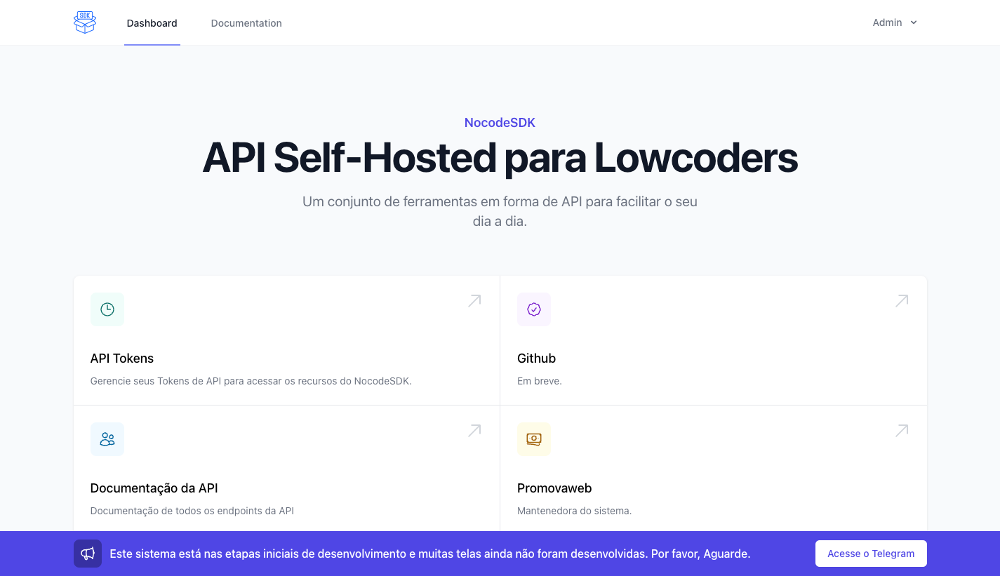

# API Self-Hosted para Lowcoders

Um conjunto de ferramentas em forma de API para facilitar o seu dia a dia.



### Assista a Live de Apresentação:

https://youtu.be/cZIJcbM2MnA

## Deploy

```yaml
version: "3"

services:
  nocodesdk:
    image: luizeof/nocodesdk-ce:latest
    command: "php -d variables_order=EGPCS /var/www/html/artisan --workers=1 octane:start --server=swoole --host=0.0.0.0 --port=80"
    ports:
      80:80
    restart: always
    environment:
      - APP_EMAIL=luizeof@gmail.com
      - APP_PASSWORD=senhadouser
      - DB_CONNECTION=mysql
      - DB_HOST=mysql
      - DB_PORT=3306
      - DB_USERNAME=root
      - DB_DATABASE=nocodesdk
      - DB_PASSWORD=senhadobanco
      - APP_ENV=production
      - APP_URL=https://sdk.meusite.com.br
      - APP_KEY=base64:C8WEFustI1vOXIdX/xXab08FGFa23fR+IxrhYWM5j2Q=
      - REDIS_HOST=redis
      - REDIS_PORT=6379
      - OCTANE_SERVER=swoole
  redis:
    image: redis:latest
    command: ["redis-server", "--appendonly", "yes"]
  mysql:
    image: mysql
    command: --default-authentication-plugin=mysql_native_password
    restart: always
    environment:
      MYSQL_ROOT_PASSWORD: senhadobanco
```
